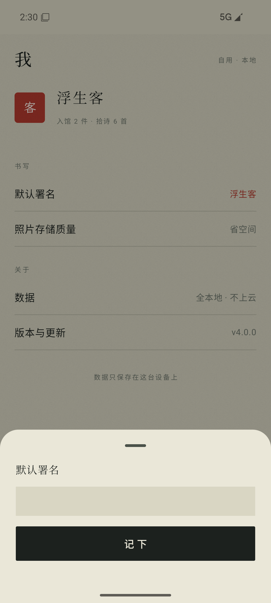
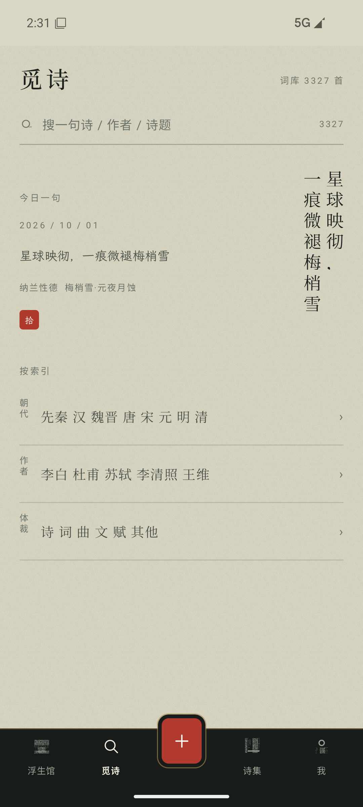
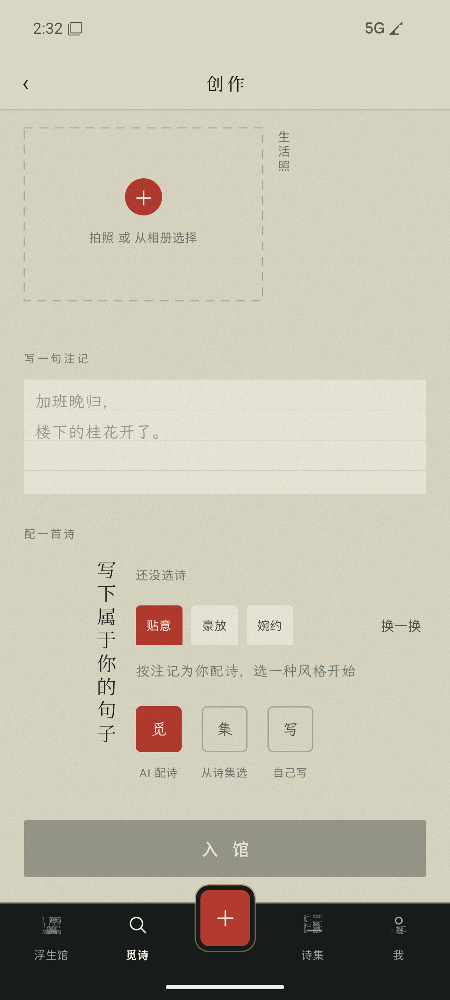
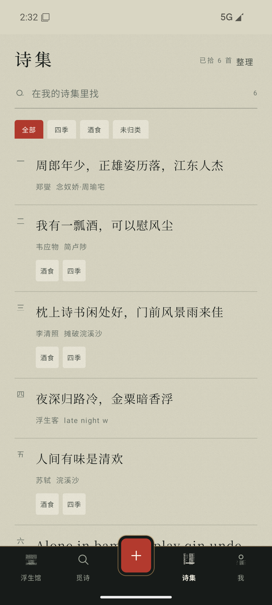
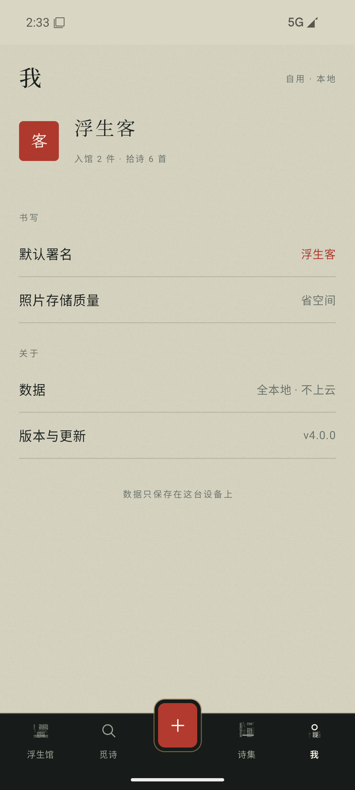

# 浮生诗集

<p align="center">
  
</p>

> 古诗词 × 生活照片的私人手卷：拍下生活瞬间，写一句注记，配一首诗，入馆成卷。

**「手卷」视觉**——照片是书页上的图版，诗是竖排墨字，注记是旁批小楷，日期署名是朱砂小印，底部五键是深墨木轴。纸色 `#D9D6C3` / 墨 `#1C211E` / 朱砂 `#B33A2E`，全局无阴影、图片直角无装饰。

## 诗 × 画

App 的内核是「用诗词描述生活，用生活表达诗意」——一首诗，配上一幅此刻的画面：

<table>
  <tr>
    <td align="center" width="33%"><br><sub><b>我见青山多妩媚，料青山见我应如是</b></sub></td>
    <td align="center" width="33%"><br><sub><b>树深时见鹿，溪午不闻钟</b></sub></td>
    <td align="center" width="33%"><br><sub><b>一畦春韭绿，十里稻花香</b></sub></td>
  </tr>
  <tr>
    <td align="center"><br><sub><b>我有一瓢酒，可以慰风尘</b></sub></td>
    <td align="center"><br><sub><b>人间有味是清欢</b></sub></td>
    <td align="center"><br><sub><b>明月如霜，好风如水，清景无限</b></sub></td>
  </tr>
  <tr>
    <td align="center"><br><sub><b>一生大笑能几回，斗酒相逢须醉倒</b></sub></td>
    <td align="center"><br><sub><b>守得云开见月明</b></sub></td>
    <td align="center"><br><sub><b>晚云收，淡天一片琉璃</b></sub></td>
  </tr>
</table>

## 五键 · 一卷

| 浮生馆 | 作品夜展 | 觅诗 |
|---|---|---|
|  |  |  |

| 创作 | 诗集 | 我 |
|---|---|---|
|  |  |  |

- **浮生馆**：作品流按月分组，横图 / 竖图 / 方图按原图比例展陈（不为版式裁剪照片），月份竖排分隔，日期朱砂印；点开一件进「夜展」——夜墨底上一卷笺面，金印存图
- **觅诗**：今日一句 + 3327 首词库全库搜索 + 按朝代 / 作者 / 体裁索引浏览，圆钮「拾」收进诗集，诗详情带译文 / 注释 / 赏析
- **创作**：拍照/选图 → 笺纸注记（楷体 + 淡横线）→ 三枚方印配诗「觅 / 集 / 写」——AI 按注记配诗（贴意 / 豪放 / 婉约）、从诗集选、自己写（残句可 AI 补全）→ 入馆
- **诗集**：标签书签筛选、诗叶列表（竖排叶码）、整理模式批量打标签 / 移出
- **我**：默认署名、照片存储质量；数据全本地——无账号、无云同步、无社交、无推送

## 🛠 技术栈

`Kotlin` · `Jetpack Compose` · `Room` · `Ktor` · `Coil`

- **竖排诗**：逐字竖排组件（列右→左、字上→下，每字定高格子实现 0.18em 字距），对齐 CSS `writing-mode: vertical-rl` 语义
- **内置字体**：思源宋体可变字体（Noto Serif SC VF）+ 霞鹜文楷（LXGW WenKai），不依赖系统字体
- **词库**：3327 首名篇（assets/corpus.json），全部带译文 / 注释 / 赏析；诗文整理自开源 [gushiwen 数据集](https://github.com/chinese-poetry)，仅供学习使用
- **设计定稿**：`输出/浮生诗集_定稿/`（规格书 + 视觉稿 + HTML 实现参考），色板与版式令牌见 `android/.../ui/theme/Theme.kt`

## 🚀 快速开始

```bash
git clone https://github.com/biubiukangkang/fusheng-poetry.git
cd fusheng-poetry/android
# AI 配诗需在 android/local.properties 配置（可选，不影响其余功能）：
# AGNES_API_KEY=sk-xxx
./gradlew assembleDebug
```

或直接安装 Release 里的 APK；应用内更新已启用（「我 → 版本与更新」）。

## 📄 许可证

MIT
